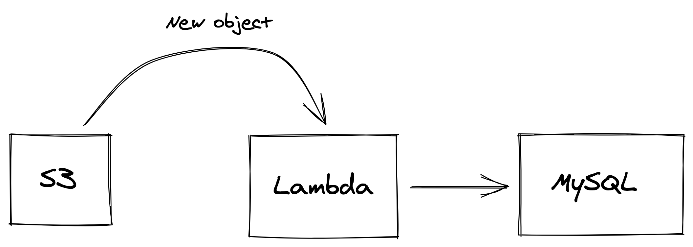
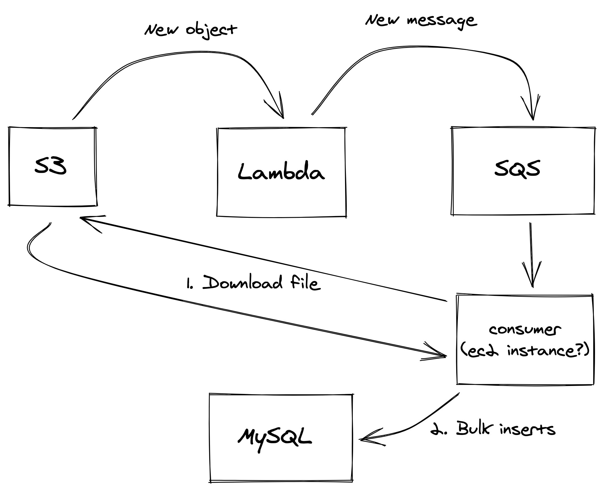

# AWS S3 CSV Parser

[](https://pkg.go.dev/github.com/gulien/aws-s3-csv-parser)
[](https://github.com/gulien/aws-s3-csv-parser/actions/workflows/lint.yml)
[](https://goreportcard.com/report/github.com/gulien/aws-s3-csv-parser)

A simple CLI which downloads a CSV file from S3 and inserts its data into a MySQL database.

```
Usage of aws-s3-csv-parser:
      --bucket string   Set the AWS S3 bucket
      --key string      Set the AWS S3 object key to download
      --region string   Set the AWS region
      --skip-download   Skip download if true (i.e, file has already been downloaded)
      --timeout int     Set the maximum duration in seconds before timing out (default 300)
```

## Hypotheses

The CSV file will, at least in the near future, always:

* Have the same columns' names and order.
* Have normalized data
* Use `,` as separator

## Implementation Details

The steps could be summarized to:

1. Download the CSV file from S3
2. Parse the CSV file.
3. For each 1000 records parsed, bulk insert them into a MySQL table.

Most of the core logic can be found in the `pkg` folder, while the `main` file glues everything together.
In other words, one could move from a command to any other trigger (REST API, lambda, consumer) without having to change
the core logic.

Also, both the file storage (i.e, S3) and data source (i.e, MySQL) could be changed in the future by implementing the
`filestorage.Downloader` and `datastorage.Inserter` interfaces.

## In case of failure

If the process fails for whatever reasons, one may relaunch the process from the start. Indeed, current implementation 
ignores the MySQL `Error 1062: Duplicate entry` error. 

## What's next?

As we may not want to rely on manual intervention to trigger the process, we can imagine two different solutions.

The first one relies on AWS lambdas:



Everytime a new object (i.e., CSV file) is put into the S3 bucket, an event triggers a lambda which handles the process.
This solution is cost-effective, but we might encounter some limitations in the future 
(e.g, reaching the lambda execution time limit if the CSV file is too big).

To work around those limitations, the second solution relies on a messages' queue + consumer:



📣 We could also witch from a MySQL database (i.e., AWS RDS) to DynamoDB serverless for saving even more money, but I
do believe that SQL > No-SQL for data analysis.

## Development

**Requirements**

* Go >= 1.16
* [golangci-lint](https://golangci-lint.run/) >= 1.39
* Docker and Docker Compose (latest versions)
* A linux-like terminal (ideally)

**Makefile commands**

* `make up` - Starts the MySQL database and phpMyAdmin Docker containers
* `make down` - Stops the MySQL database and phpMyAdmin Docker containers 
* `make fmt` - Shortcut for `go fmt` and `go mod tidy`
* `make lint` - Runs linters
* `make todos` - Shows TODOs
* `make godoc` - Runs a local webserver for godoc
* `make run` - Runs the application (`REGION`, `BUCKET`, `KEY`, `TIMEOUT` and `SKIP_DOWNLOAD` are available as variables, i.e, `make run BUCKET=foo`)
* `make build` - Builds the application (`VERSION` is available as variable, i.e, `make build VERSION=foo`)